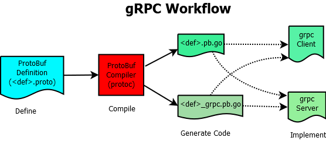

# Pet project gRPC-Quest - The Quest of gRPC
## _Abstract_
_REST_, _gRPC_ and _GraphQL_ are the three ubiquitous API technologies. There have been articles [1, 2] comparing the three, and suggesting when to use which.

Following my pet project of retrieving articles in RESTful API [3], this project is about evaluating _gRPC_. gRPC also known as Google Remote Procedure Call is an open source remote procedure call system initially developed at Google in 2015 as the next generation of the RPC infrastructure Stubby.

## _Libraries/Tools in Use_
| Library/Tool | Description | Version | 
|:-----------------|:-------:|-----------|
| protoc/libprotoc | Proto Buf Compiler | v3.19.4 |
| grpc_go | grpc with Golang | v1.43.0 |

## _Workflow_
 
_<def>_ stands for the project name, in this pet project, it's _helloworld_.
  
### Defining Service
The first step is to define _gRPC service_ and methods of _request_ and _response_ types using _protocol_ buffers. All these are defined in _.proto_ file. 

### Compiling Protocol Buffer to Generate Code
Issue following command to generate code
<pre>
$ protoc --go_out=. --go_opt=paths=source_relative \
    --go-grpc_out=. --go-grpc_opt=paths=source_relative \
    helloworld/helloworld.proto
</pre>    
It tells,
- where to get .proto file as input;
- via option _go_out_, the resultant __&lt;def&gt;.pb.go__ output file will be placed at the same directory relaive to input source, via option _go_opt_; and
- via option _go-grpc_out_, the resultant __&lt;def&gt;_grpc.pb.go__ output file will be placed at the same directory relaive to input source, via option _go-grpc_opt_;
  
### Implementation

## _References_
[1] https://www.infoq.com/podcasts/api-showdown-rest-graphql-grpc/?utm_source=email&utm_medium=toppodcasts&utm_campaign=newsletter&utm_content=01252022 
[2] https://www.itechart.com/blog/performance-begins-with-design-style/  
[3] https://github.com/SpenserKao/article_REST 
